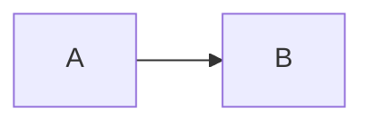
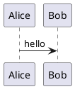

# Authoring guide

Course content is plain Markdown, so it also reads well on GitHub. This
guide describes the repository layout and the Markdown features you can use.

## Repository layout

```
README.md                         home page of the website
info/
  general.yaml                    course information  (see course-info.md)
  assessment.yaml                 assessment components and their matrices
  genAI.yaml                      generative-AI policy for the assignments
  *.md                            extra pages under "Course information"
lessons/
  week_01/
    README.md                     week overview (title = week name)
    lecture1.md                   lectures, in file-name order
    lecture2.md
    images/                       images, data, ... (any name)
assignments/
  week_01/
    README.md                     optional: introduction to the week's assignments
    assignment1.md                a single-page assignment
    es_w1_session1.md             a logbook, named in an assignment's front matter
    assignment2/                  an assignment with files
      index.md                    the assignment (README.md also works)
      starter/                    zipped as week_01-assignment2.zip and linked
slides/
  week_01/
    lecture1.pptx                 the PowerPoint source (not published)
    lecture1.pdf                  exported PDF, shown on lessons/week_01/lecture1.md
exams/
  README.md                       optional introduction
  example_exam.md
references/
  README.md                       optional introduction
  *.md, *.pdf
```

- **Weeks** are directories named `week_01`, `week_02`, … `week_10`, … (an
  underscore and at least two digits, so they sort correctly) in `lessons/`,
  `assignments/` and `slides/`. A week appears in the sidebar as soon as one
  of them exists. Add or remove weeks freely. Directories with other names,
  such as `week1`, are ignored, with a warning.
- **Week names** come from the title of `lessons/week_NN/README.md`: the title
  "Stacks and queues" in `lessons/week_02/README.md` gives
  "Week 2: Stacks and queues" in the sidebar.
- **Order:** pages are ordered by file name (`lecture2` before `lecture10`).
  To override this, add `order: 1` (2, 3, …) to the front matter.
- **`private` directories** are never published, wherever they are: solutions,
  exam answers, hidden tests. They are also left out of starter-file zips.
  They are still in the git repository, so keep the repository private if
  that matters.
- Files and directories whose names start with `.` are ignored.

## Page titles

The title of a page is, in order of preference:

1. `title:` in YAML front matter;
2. the first line of the file, if it is a level-1 heading (`# Title`);
3. the file name (`lecture1.md` → "Lecture 1").

Option 2 is recommended: it reads well on GitHub. Start sections with `##`.

## Slides

Export the PowerPoint slides to PDF (*File → Export → PDF*) and commit the PDF
next to the `.pptx` in `slides/week_NN/`, with the same name as the lecture. The
lecture page `lessons/week_NN/lecture1.md` then shows a "Slides" box linking to
`slides/week_NN/lecture1.pdf`. Without a PDF, the box says "No presentation
yet". The `.pptx` files are not published.

In the front matter of a lecture:

```yaml
slides: intro-and-overview   # use slides/week_NN/intro-and-overview.pdf instead
slides: false                # no slides box on this page
```

## Assignments with starter files

Put the assignment in its own directory with an `index.md` and a `starter/`
directory. The starter directory is zipped (as `week_NN-<name>.zip`) and a
download box is added to the top of the assignment. Anything in a `private`
directory, like a reference solution, stays out of the zip and the website.

## Generative AI in assignments

The course's GenAI policy is set in `info/genAI.yaml` (see
[course-info.md](course-info.md#infogenaiyaml)). Every assignment page shows
at the top what is allowed in it: GenAI *allowed, with citation*, *as a tutor
only* (to explain things; nothing generated is handed in) or *not allowed*.
Where the policy permits, an assignment deviates from the course default in
its front matter:

```yaml
---
genai: allowed               # or: tutor, not-allowed
---
```

Add a `note` to explain the exception:

```yaml
---
genai:
  use: allowed
  note: Use it for the tests only; write `is_balanced` yourself.
---
```

## Logbooks

A logbook is a Markdown file that students download, fill in (code,
answers, names) and hand in, for example as a PDF. Name it in the front
matter of its assignment, with a path relative to the assignment:

```yaml
---
logbook: es_w1_session1.md         # several: [session1.md, session2.md]
---
```

The assignment page then gets a *Logbook* box with a link to **download** the
file, published unchanged, and a link to a **preview** on the website. The
preview page links back to the assignment and has no PDF. A file named as a
logbook is not an assignment of its own, so it does not appear in the
sidebar.

## Links

Link to other pages by their Markdown file, with a relative path, as on
GitHub:

```markdown
See [lecture 2](lecture2.md) and the [first assignment](../../assignments/week_01/assignment1.md).
The [course information](info/general.yaml), [assessment](info/assessment.yaml)
and [GenAI policy](info/genAI.yaml).
```

On the website these become links to the pages. In PDFs they become links to
the published website. Links to `info/general.yaml`, `info/assessment.yaml`
and `info/genAI.yaml` lead to the generated pages.

## Markdown features

The Markdown is [Pandoc Markdown](https://quarto.org/docs/authoring/markdown-basics.html)
as used by Quarto: everything from GitHub Markdown, plus the features below.
See `lessons/week_01/lecture1.md` in the template course for examples of all of
them.

### Math

```markdown
Inline $O(n \log n)$ and display math:

$$
\sum_{i=1}^{n} i = \frac{n(n+1)}{2}
$$
```

### Callouts

```markdown
::: {.callout-tip}
## Optional title
Text of the tip.
:::
```

The types are `callout-note`, `callout-tip`, `callout-warning`,
`callout-important` and `callout-caution`.

### Tabs

```markdown
::: {.panel-tabset}
### Python
...
### C
...
:::
```

In the PDF, tabs are shown one after the other.

### Code

Fenced code blocks with a language get syntax highlighting and, on the
website, a copy button. Code is only displayed, never run: even
```` ```{python} ```` is shown as a normal code block.

### Diagrams

Mermaid and PlantUML are written in fenced blocks. GitHub shows Mermaid
diagrams in its preview too:

````markdown



````

Diagrams are **centred** on the website and in the PDF. To align one on the
left (or right) instead, start it with a `fig-align` comment line. The comment
marker is `%%` in Mermaid and `'` in PlantUML, so GitHub and the diagram tools
ignore the line:

````markdown


````

### Images

```markdown
{width=60%}
```

Use paths relative to the page. SVG gives the sharpest result on screen and in
PDFs.

## Page footer: dates from git

Every page ends with a footer that says when its source file was added to the
repository and when, and by whom, it was last changed:

> Added on 23 February 2026.
> Last changed on 5 September 2026 at 14:32 by Robert Changeling.

The dates and the name come from the git history of the page's source file
(for the course information pages: the YAML file). Times are shown in Dutch
time. Renamed or moved files keep their original date. The name is the
author name of the commit, so set it properly once:
`git config --global user.name "Your Name"`. Files that are not committed yet
have no footer.

## Previewing

Run `course preview` in the course repository. It shows the website on
<http://localhost:4200> and updates the page when you save a file. Run
`course build` for the full output, including the PDFs, in `dist/`. Add
`?embed=1` to a page URL to see it as it appears in Brightspace.
